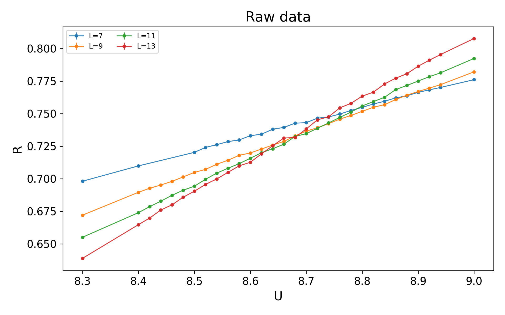
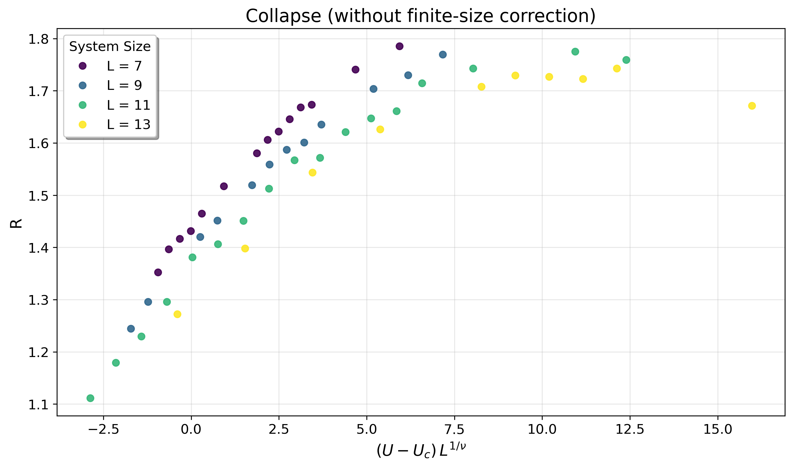
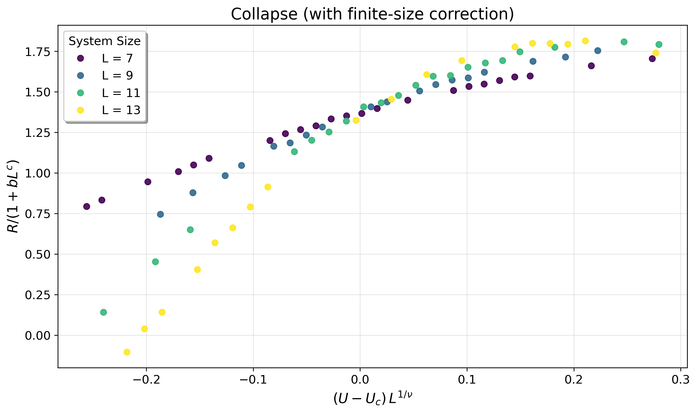

# datacollapse —— Quantum Critical Point Data Collapse Library

[English](#datacollapse--quantum-critical-point-data-collapse-library) | [中文](#datacollapse--量子临界点数据坍缩工具库)

A Python library for finite-size scaling (FSS) data collapse analysis:
- Without finite-size correction: Y ≈ f((U − U_c) L^a)
- With finite-size correction: Y ≈ f((U − U_c) L^a) · (1 + b L^c), with normalization support to eliminate amplitude degeneracy
- Universal function f(x) represented by linear splines with second-difference smoothing, no need for analytical forms
- Weighted least squares (weights = 1/σ²) with bootstrap uncertainty estimation
- Multi-optimizer support with random restarts and robust finite-size-correction variants

---

## 🎯 Key Features
- Joint fitting of (U_c, a[, b, c]) parameters with spline curve f(x)
- Robust finite-size-correction interface: grid over (b, c), inner loop optimizes only (U_c, a)
- Optimizer options: Nelder–Mead, Powell, or "NM→Powell" combination; supports random_restarts
- Unified random_state for reproducibility
- Compatible with `numpy`, `scipy`, `matplotlib`

---

## 📊 Data Collapse Visualization

### Before Collapse (Raw Data)


### After Collapse (without finite-size correction)


### After Collapse (with finite-size correction)


---

## 🚀 Installation

Local development installation:
```bash
pip install -e .
```

Or using `requirements.txt`:
```bash
pip install -r requirements.txt
pip install -e .
```

---

## 📋 Data Format

Input `data` should be a `numpy.ndarray` of shape (N,3):
- Column 1: L (system size, positive numbers)
- Column 2: U (control parameter)
- Column 3: Y (observable, e.g., R)

Optional `err` (shape (N,) or (N,k)), last column is σ (vertical error bar) for each point.

---

## 💡 Quick Examples

### Minimal Example (without finite-size correction)
```python
import numpy as np
from datacollapse import fit_data_collapse, collapse_transform

# Generate example data (replace with your own data)
L = np.repeat([7,9,11,13], 25)
U = np.tile(np.linspace(8.3, 9.0, 25), 4)
# Quadratic-like dependence in the scaling variable
Y = 0.6 + 0.12*((U-8.6)*L**1.1) + 0.08*((U-8.6)*L**1.1)**2 + 0.02*np.random.randn(L.size)
err = 0.03*np.ones_like(Y)

data = np.column_stack([L,U,Y])
(params, errs) = fit_data_collapse(
    data, err,
    U_c_0=8.6, a_0=1.0,
    n_knots=12, lam=1e-3, n_boot=10,
    bounds=((8.3,8.9),(0.3,2.0)),
    optimizer="NM_then_Powell", random_restarts=10, maxiter=4000,
)
print("Uc,a:", params, "+/-", errs)

x, Yc = collapse_transform(data, params)
# Plot (x, Yc) with matplotlib, color-coded by L
```

### Minimal Example (with finite-size correction, robust variant)
```python
import numpy as np
from datacollapse import fit_data_collapse_fse_robust, collapse_transform

# data/err as above
b_grid = np.linspace(0.2, 1.2, 6)
c_grid = np.linspace(-1.5, -0.3, 7)

(params, errs) = fit_data_collapse_fse_robust(
    data, err,
    U_c_0=8.6, a_0=1.0,
    b_grid=b_grid, c_grid=c_grid,
    n_knots=12, lam=1e-3, n_boot=5,
    bounds_Ua=((-np.inf,np.inf),(0.3,2.0)),
    optimizer="NM_then_Powell", random_restarts=5,
    normalize=True, L_ref="geom",
)
print("Uc,a,b,c:", params, "+/-", errs)

x, Yc = collapse_transform(data, params, normalize=True, L_ref="geom")
```

---

## 🖥️ CLI Usage (Optional)

The repository provides `cli.py`:
```bash
python cli.py --csv your_data.csv --mode nofse \
  --Uc0 8.65 --a0 1.0 --n_knots 12 --lam 1e-3 \
  --bounds "[[8.3,8.9],[0.3,2.0]]" --random_restarts 10

python cli.py --csv your_data.csv --mode fse-robust \
  --Uc0 8.65 --a0 1.0 --b_grid "0.2:1.2:0.2" --c_grid "-1.5:-0.3:0.2" \
  --n_knots 12 --lam 1e-3 --normalize --L_ref geom
# Note: "fse-robust" mode performs a grid over (b,c) while optimizing (Uc,a)
```

---

## ⚙️ Recommended Settings & Best Practices

### Parameter Bounds
- `a` (ν^(-1)): [0.3, 2.0] if no prior; widen and use `random_restarts` if local minima issues
- Finite-size correction exponent `c < 0` (e.g., [-1.5, -0.05]); recommend `normalize=True` to reduce amplitude degeneracy

### Spline Parameters
- `n_knots`: 10–16 commonly used
- `lam`: tune between 1e-4～1e-2, watch for overfitting/over-smoothing

### Robustness
- Enable `random_restarts` with wider `bounds` to avoid "local minimum traps"
- Use `fit_data_collapse_fse_robust` for grid search over (b,c), inner optimization of (U_c,a)
- Reproducibility: fix `random_state`

---

## 🔧 Troubleshooting

- Optimization stuck at boundaries or oscillating: Relax/reset `bounds`, increase `random_restarts`, or switch optimizers
- Finite-size correction (b,c) unstable: Enable `normalize=True`; use robust variant; moderately increase `lam`
- Poor visual overlap: Ensure using same (U_c,a,b,c) set for plotting with finite-size correction; confirm `normalize/L_ref` consistency

---

## 📦 Dependencies

- Python 3.9+
- numpy, scipy, matplotlib, pandas (if using CSV)
- pytest (for running tests)

---

## 🛣️ Roadmap & Contributing

- Welcome issues/PRs; unit tests in `tests/`
- Future plans: MCP service encapsulation and upstream contribution to mcp.science

---

## 📄 License

MIT © 2025 Yin-Kai Yu (余荫铠)

---

## 🔗 Links

- Library API: `src/datacollapse/README.md`
- GitHub: https://github.com/YinkaiYu/datacollapse

---

---

# datacollapse —— 量子临界点数据坍缩工具库

[English](#datacollapse--quantum-critical-point-data-collapse-library) | [中文](#datacollapse--量子临界点数据坍缩工具库)

一个用于有限尺寸标度（Finite-Size Scaling, FSS）数据坍缩的 Python 库：
- 无有限尺寸修正：Y ≈ f((U − U_c) L^a)
- 带有限尺寸修正：Y ≈ f((U − U_c) L^a) · (1 + b L^c)，支持归一化以降低幅度简并
- f(x) 由带二阶差分平滑的线性样条表示，无需预设解析形式
- 加权最小二乘（权重=1/σ²），并支持 bootstrap 估计不确定度
- 多优化器、多起点随机重启、有限尺寸修正的稳健变体

---

## 🎯 特性亮点
- 联合拟合 (U_c, a[, b, c]) 与样条曲线 f(x)
- 有限尺寸修正的稳健接口：对 (b, c) 栅格搜索，内层仅优化 (U_c, a)
- 优化器可选：Nelder–Mead、Powell、或"NM→Powell"组合；支持 random_restarts
- 统一 random_state 以保证可重复性
- 兼容 `numpy`, `scipy`, `matplotlib`

---

## 📊 数据坍缩可视化

### 坍缩前（原始数据）


### 坍缩后（不含有限尺寸修正）


### 坍缩后（包含有限尺寸修正）


---

## 🚀 安装

本地开发安装：
```bash
pip install -e .
```

或使用 `requirements.txt`：
```bash
pip install -r requirements.txt
pip install -e .
```

---

## 📋 数据格式
输入 `data` 为形状 (N,3) 的 `numpy.ndarray`，列含义：
- 第1列：L（系统尺寸，正数）
- 第2列：U（控制参数）
- 第3列：Y（无量纲量，例如 R）
可选 `err`（形状 (N,) 或 (N,k)），最后一列为该点的 σ（竖向误差）。

---

## 💡 最小示例（不含有限尺寸修正）
```python
import numpy as np
from datacollapse import fit_data_collapse, collapse_transform

# 伪造示例数据（请用你自己的数据替换），采用二次型依赖
L = np.repeat([7,9,11,13], 25)
U = np.tile(np.linspace(8.3, 9.0, 25), 4)
Y = 0.6 + 0.12*((U-8.6)*L**1.1) + 0.08*((U-8.6)*L**1.1)**2 + 0.02*np.random.randn(L.size)
err = 0.03*np.ones_like(Y)

data = np.column_stack([L,U,Y])
(params, errs) = fit_data_collapse(
    data, err,
    U_c_0=8.6, a_0=1.0,
    n_knots=12, lam=1e-3, n_boot=10,
    bounds=((8.3,8.9),(0.3,2.0)),
    optimizer="NM_then_Powell", random_restarts=10, maxiter=4000,
)
print("Uc,a:", params, "+/-", errs)

x, Yc = collapse_transform(data, params)
# 之后可用 matplotlib 以颜色区分 L 绘制 (x, Yc)
```

---

## 💡 最小示例（包含有限尺寸修正，稳健变体）
```python
import numpy as np
from datacollapse import fit_data_collapse_fse_robust, collapse_transform

# data/err 同上
b_grid = np.linspace(0.2, 1.2, 6)
c_grid = np.linspace(-1.5, -0.3, 7)

(params, errs) = fit_data_collapse_fse_robust(
    data, err,
    U_c_0=8.6, a_0=1.0,
    b_grid=b_grid, c_grid=c_grid,
    n_knots=12, lam=1e-3, n_boot=5,
    bounds_Ua=((-np.inf,np.inf),(0.3,2.0)),
    optimizer="NM_then_Powell", random_restarts=5,
    normalize=True, L_ref="geom",
)
print("Uc,a,b,c:", params, "+/-", errs)

x, Yc = collapse_transform(data, params, normalize=True, L_ref="geom")
```

---

## 🖥️ CLI 用法（可选）
仓库提供 `cli.py`，示例：
```bash
python cli.py --csv your_data.csv --mode nofse \
  --Uc0 8.65 --a0 1.0 --n_knots 12 --lam 1e-3 \
  --bounds "[[8.3,8.9],[0.3,2.0]]" --random_restarts 10

python cli.py --csv your_data.csv --mode fse-robust \
  --Uc0 8.65 --a0 1.0 --b_grid "0.2:1.2:0.2" --c_grid "-1.5:-0.3:0.2" \
  --n_knots 12 --lam 1e-3 --normalize --L_ref geom
# 注："fse-robust" 模式会在 (b,c) 栅格上搜索，并在内层优化 (U_c,a)
```

---

## ⚙️ 推荐设置与经验
- `bounds`：
  - `a`（即 ν^(-1)）若无先验，可设 [0.3, 2.0]；若局部最小值多，适当放宽并配合 `random_restarts`
  - 有限尺寸修正中 `c < 0`（如 [-1.5, -0.05]）；建议使用 `normalize=True` 降低幅度简并
- `n_knots` 与 `lam`：
  - 10–16 个结点较常用；`lam` 在 1e-4～1e-2 间调优，观察过拟合/过平滑迹象
- 稳健性：
  - 启用 `random_restarts` 与更宽 `bounds`，避免"局部极小值陷阱"
  - 使用 `fit_data_collapse_fse_robust` 在 (b,c) 栅格上先粗搜，再内层优化 (U_c,a)
- 可重复性：
  - 通过 `random_state` 固定随机性

---

## 🔧 故障排查
- 优化停在边界或震荡：放宽/重设 `bounds`，增加 `random_restarts`，或切换优化器
- 有限尺寸修正 (b,c) 不稳定：启用 `normalize=True`；改用稳健变体；适度增大 `lam`
- 可视化不重叠：绘图时确保使用同一组 (U_c,a,b,c) 参数；检查 `normalize/L_ref` 与拟合时一致

---

## 📦 依赖
- Python 3.9+
- numpy, scipy, matplotlib, pandas（若用 CSV）
- pytest（运行测试时）

---

## 🛣️ 贡献与路线图
- 欢迎提交问题/PR；单元测试位于 `tests/`
- 后续计划：MCP 服务封装与上游贡献（mcp.science）

---

## 📄 许可证
MIT © 2025 Yin-Kai Yu (余荫铠)

---

## 🔗 链接
- 库 API：`src/datacollapse/README.md`
- GitHub：https://github.com/YinkaiYu/datacollapse

---

## 📝 附：绘图小建议
- Matplotlib 文本建议使用英文/LaTeX 记号，避免中文乱码；如 `r'$R$'`
