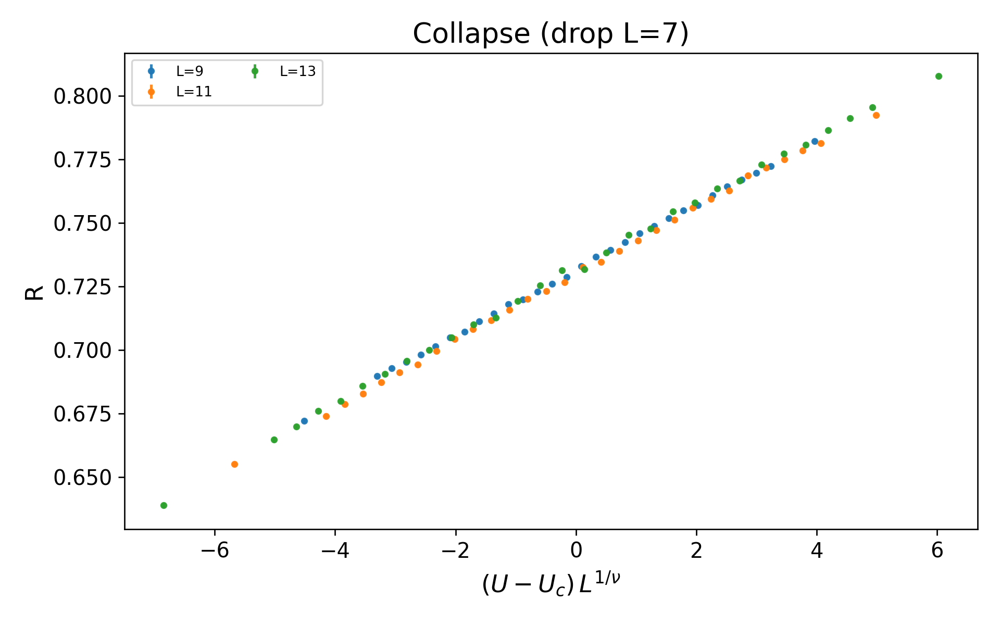
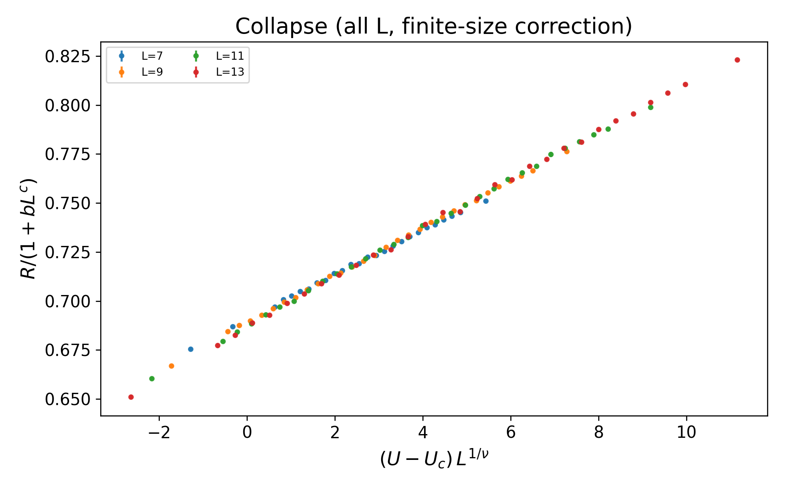

# datacollapse —— Quantum Critical Point Data Collapse Library

[English](#datacollapse--quantum-critical-point-data-collapse-library) | [中文](#datacollapse--量子临界点数据坍缩工具库)

A Python library for finite-size scaling (FSS) data collapse analysis:
- Without finite-size correction: Y ≈ f((U − U_c) L^a)
- With finite-size correction: Y ≈ f((U − U_c) L^a) · (1 + b L^c), with normalization support to eliminate amplitude degeneracy
- Universal function f(x) represented by linear splines with second-difference smoothing, no need for analytical forms
- Weighted least squares (weights = 1/σ²) with bootstrap uncertainty estimation
- Multi-optimizer support with random restarts and robust finite-size-correction variants

---

## 🎯 Key Features
- Joint fitting of (U_c, a[, b, c]) parameters with spline curve f(x)
- Robust finite-size-correction interface: grid over (b, c), inner loop optimizes only (U_c, a)
- Optimizer options: Nelder–Mead, Powell, or "NM→Powell" combination; supports random_restarts
- Unified random_state for reproducibility
- Compatible with `numpy`, `scipy`, `matplotlib`

---

## 📊 Data Collapse Visualization

These images are built from real data bundled in this repository (`examples/sample_data.csv`, derived from `real_data_test/real_data_combined.csv`).

### Before Collapse (Raw Data)


### After Collapse (without finite-size correction)


### After Collapse (with finite-size correction)


---

## 🚀 Installation

Local development installation:
```bash
pip install -e .
```

Or using `requirements.txt`:
```bash
pip install -r requirements.txt
pip install -e .
```

---

## 📋 Data Format

Input `data` should be a `numpy.ndarray` of shape (N,3):
- Column 1: L (system size, positive numbers)
- Column 2: U (control parameter)
- Column 3: Y (observable, e.g., R)

Optional `err` (shape (N,) or (N,k)), last column is σ (vertical error bar) for each point.

---

## 💡 Quick Examples

- Run robust finite-size-corrected example on the real dataset:
  ```bash
  python examples/run_example.py
  ```
  This reads `examples/sample_data.csv` (real data) and produces `examples/plot_before.png` and `examples/plot_after.png`.

- Rebuild README visuals from real data:
  ```bash
  python examples/build_readme_images_from_real.py
  ```
  This rebuilds the three images under `docs/images/` using `real_data_test/real_data_combined.csv` parameters and workflow.

---

## ⚙️ Recommended Settings & Best Practices

### Parameter Bounds
- `a` (ν^(-1)): [0.3, 2.0] if no prior; widen and use `random_restarts` if local minima issues
- Finite-size correction exponent `c < 0` (e.g., [-1.5, -0.05]); recommend `normalize=True` to reduce amplitude degeneracy

### Spline Parameters
- `n_knots`: 10–16 commonly used
- `lam`: tune between 1e-4～1e-2, watch for overfitting/over-smoothing

### Robustness
- Enable `random_restarts` with wider `bounds` to avoid "local minimum traps"
- Use `fit_data_collapse_fse_robust` for grid search over (b,c), inner optimization of (U_c,a)
- Reproducibility: fix `random_state`

---

## 🔧 Troubleshooting

- Optimization stuck at boundaries or oscillating: Relax/reset `bounds`, increase `random_restarts`, or switch optimizers
- Finite-size correction (b,c) unstable: Enable `normalize=True`; use robust variant; moderately increase `lam`
- Poor visual overlap: Ensure using same (U_c,a,b,c) set for plotting with finite-size correction; confirm `normalize/L_ref` consistency

---

## 📦 Dependencies

- Python 3.9+
- numpy, scipy, matplotlib, pandas (if using CSV)
- pytest (for running tests)

---

## 🛣️ Roadmap & Contributing

- Welcome issues/PRs; unit tests in `tests/`
- Future plans: MCP service encapsulation and upstream contribution to mcp.science

---

## 📄 License

MIT © 2025 Yin-Kai Yu (余荫铠)

---

## 🔗 Links

- Library API: `src/datacollapse/README.md`
- GitHub: https://github.com/YinkaiYu/datacollapse

---

---

# datacollapse —— 量子临界点数据坍缩工具库

[English](#datacollapse--quantum-critical-point-data-collapse-library) | [中文](#datacollapse--量子临界点数据坍缩工具库)

一个用于有限尺寸标度（Finite-Size Scaling, FSS）数据坍缩的 Python 库：
- 无有限尺寸修正：Y ≈ f((U − U_c) L^a)
- 带有限尺寸修正：Y ≈ f((U − U_c) L^a) · (1 + b L^c)，支持归一化以降低幅度简并
- f(x) 由带二阶差分平滑的线性样条表示，无需预设解析形式
- 加权最小二乘（权重=1/σ²），并支持 bootstrap 估计不确定度
- 多优化器、多起点随机重启、有限尺寸修正的稳健变体

---

## 📊 数据坍缩可视化

下图基于仓库内真实数据（`examples/sample_data.csv`，来自 `real_data_test/real_data_combined.csv`）。

### 坍缩前（原始数据）


### 坍缩后（不含有限尺寸修正）


### 坍缩后（包含有限尺寸修正）


---

## 💡 快速示例
- 运行基于真实数据的稳健有限尺寸修正示例：
  ```bash
  python examples/run_example.py
  ```
- 用真实数据重建 README 图片：
  ```bash
  python examples/build_readme_images_from_real.py
  ```

其余章节同上英文版。

## 🔁 Quick reproducibility

- CLI (requires installation: `pip install -e .[all]`):
  ```bash
  datacollapse-cli --csv examples/sample_data.csv --mode fse-robust --outdir out
  ```
- Script (no installation needed inside repo):
  ```bash
  python examples/run_example.py
  python examples/build_readme_images_from_real.py
  ```

## 🧩 MCP (Model Context Protocol) preview

Planned endpoints (FastAPI):

- fit_nofse
  - input: csv (L,U,Y[,sigma]), U_c_0, a_0, n_knots, lam, n_boot, bounds, optimizer, maxiter, random_restarts
  - output: params (U_c,a), errs, logs, artifacts (optional images)
- fit_fse
  - input: csv, U_c_0, a_0, b_0, c_0, n_knots, lam, n_boot, bounds (c<0), normalize, L_ref, optimizer, maxiter, random_restarts
  - output: params (U_c,a,b,c), errs, logs, artifacts
- fit_fse_robust
  - input: csv, U_c_0, a_0, b_grid, c_grid, n_knots, lam, n_boot, bounds_Ua, normalize, L_ref, optimizer, maxiter, random_restarts
  - output: params (U_c,a,b,c), errs, per-cell logs, artifacts
- collapse_transform
  - input: csv, params[, normalize, L_ref]
  - output: x, Yc (arrays), or saved plot

JSON schema notes:
- bounds, bounds_Ua: [[lo,hi],[lo,hi], ...]
- normalize: boolean; L_ref: 'geom' | number
- Optimizer: 'NM' | 'Powell' | 'NM_then_Powell'

Security & limits:
- Max N points, execution timeout, concurrency limits
- Result caching & artifact expiration
